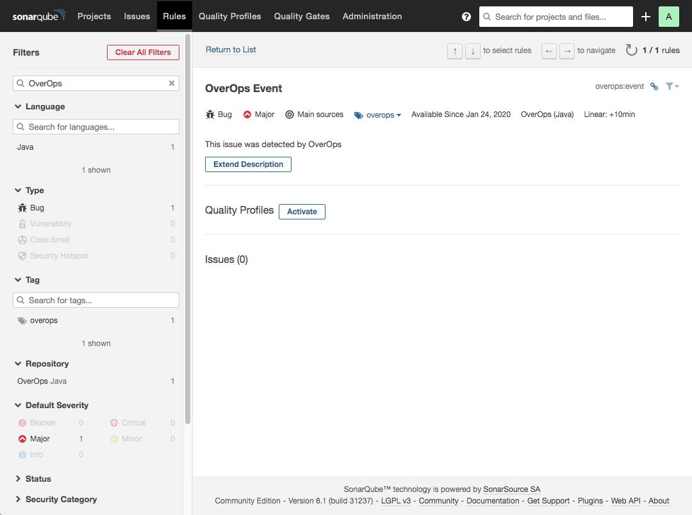
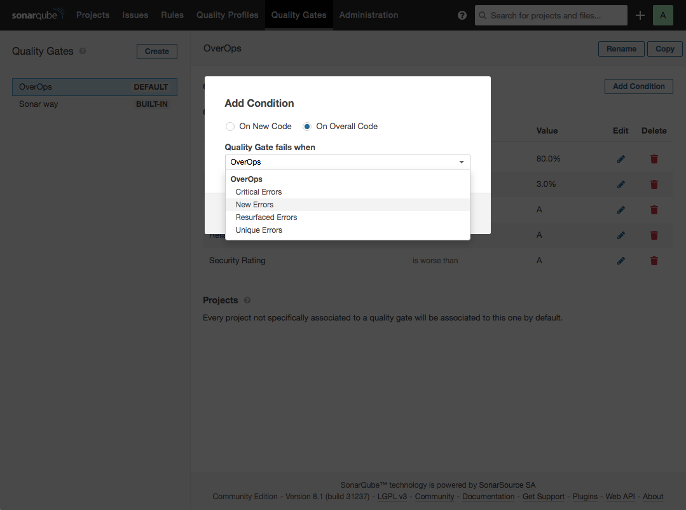
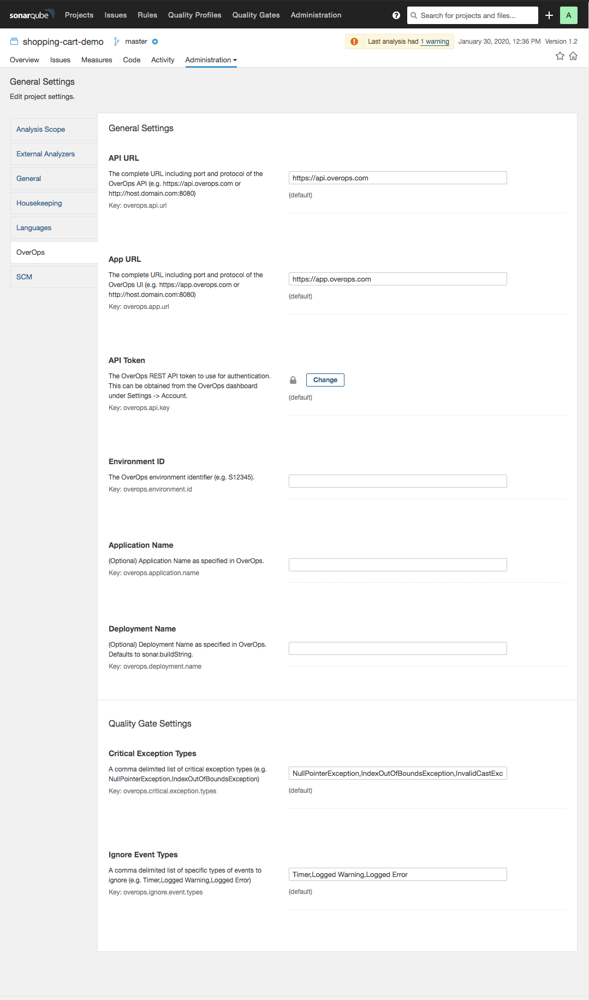
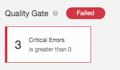
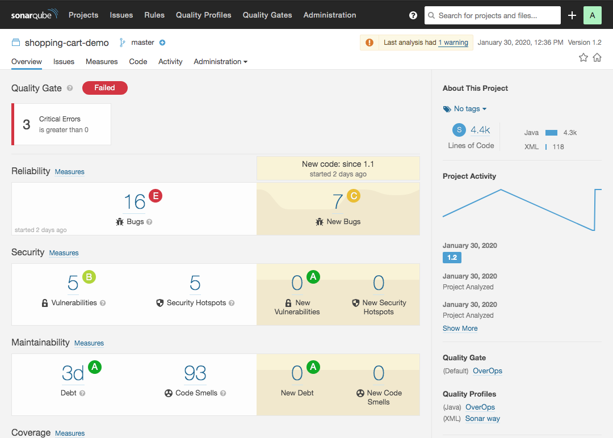
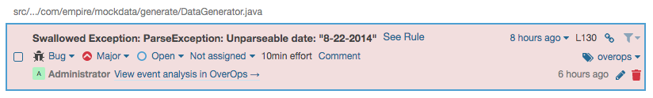
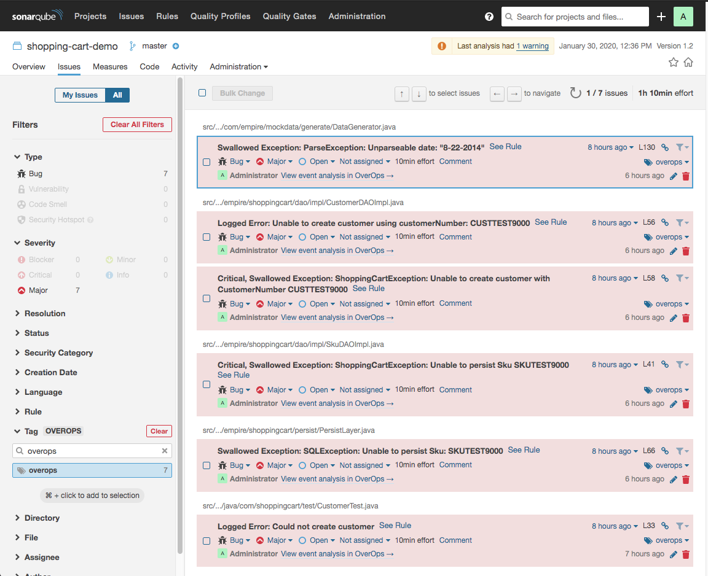
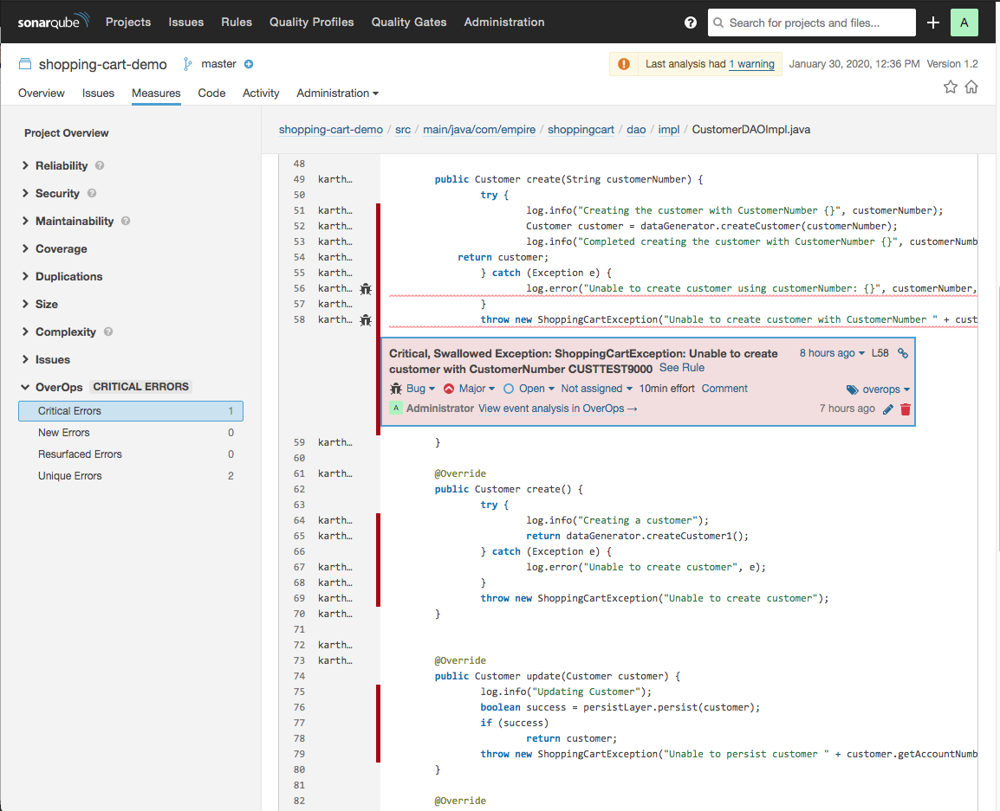
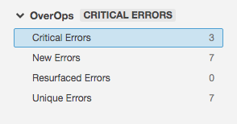
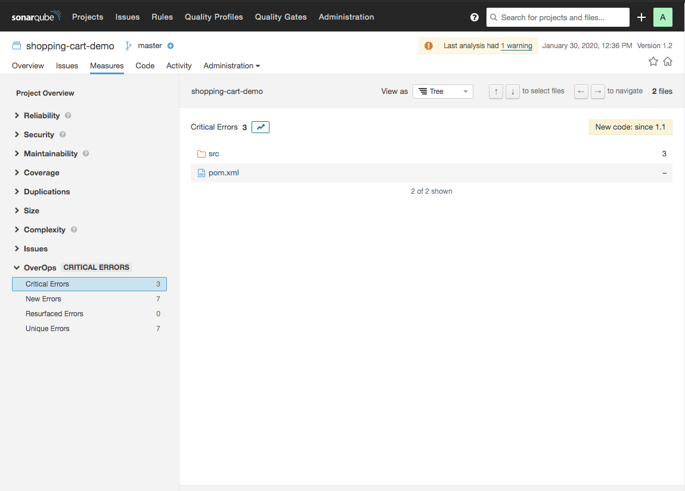

# OverOps SonarQube Plugin

Add [OverOps](https://www.overops.com/) event data as Issues and Metrics in SonarQube. *(Java only, SonarQube 7.9.1 - 8.2)*

[Installing the OverOps Plugin](#installing-the-overops-plugin)  
&nbsp;&nbsp;&nbsp;&nbsp;[Building from Source](#building-from-source)  
[Setup](#setup)  
&nbsp;&nbsp;&nbsp;&nbsp;[Activate the OverOps Event Rule](#activate-the-overops-event-rule)  
&nbsp;&nbsp;&nbsp;&nbsp;[Configure Quality Gates](#configure-quality-gates)  
&nbsp;&nbsp;&nbsp;&nbsp;[Configure the Plugin](#configure-the-plugin)  
[Running the plugin](#running-the-plugin)  
&nbsp;&nbsp;&nbsp;&nbsp;[Scan your code](#scan-your-code)  
[Viewing OverOps Data in SonarQube](#viewing-overops-data-in-sonarqube)  
&nbsp;&nbsp;&nbsp;&nbsp;[Quality Gate](#quality-gate)  
&nbsp;&nbsp;&nbsp;&nbsp;[Issues](#issues)  
&nbsp;&nbsp;&nbsp;&nbsp;[Metrics](#metrics)  

## Installing the OverOps Plugin

To install the plugin manually, download the [latest version](/takipi-field/sonar-plugin-overops/releases) to the Sonar server's ``extensions/plugins`` directory and restart the server.

### Building from Source

1. Clone this repo and in the root directory run `mvn clean package`
2. Go into the `/target` and copy the `overops-1.0.3.jar` into the Sonar server `extensions/plugins` directory
3. Restart the server and plugin will auto install onto it.

## Setup

### Activate the OverOps Event Rule

The plugin adds the OverOps Event [rule](https://docs.sonarqube.org/latest/user-guide/rules/) for Java. To enable the plugin to create issues when scanning your code, you’ll need to activate the OverOps Event rule for the [Quality Profile](https://docs.sonarqube.org/latest/instance-administration/quality-profiles/) used in your project.

### Configure Quality Gates

The OverOps plugin adds four metrics that can be used as [Quality Gate](https://docs.sonarqube.org/latest/user-guide/quality-gates/) conditions, including Critical Errors, New Errors, Resurfaced Errors, and Unique Errors. For more details about these gates, see [OverOps Quality Gates](https://doc.overops.com/docs/overops-quality-gates).

### Configure the Plugin

The plugin is configured using [analysis parameters](https://docs.sonarqube.org/latest/analysis/analysis-parameters/), which can be set in multiple places at both the global and project level.

*Note: In addition to the overops properties listed below, you’ll also need to set the `sonar.host.url` and authentication parameters. See [Analysis Parameters](https://docs.sonarqube.org/latest/analysis/analysis-parameters/) for details.*

| Name | Property | Default | Description |
| ---- | -------- | ------- | ----------- |
| API URL | `overops.api.url` | https://api.overops.com | The complete URL including port and protocol of the OverOps API |
| App URL | `overops.app.url` | https://app.overops.com | The complete URL including port and protocol of the OverOps UI |
| API Token | `overops.api.key` | | The OverOps REST API token to use for authentication. |
| Environment ID | `overops.environment.id` | | The OverOps environment identifier |
| Application Name | `overops.application.name` | | Application Name as specified in OverOps (Optional) |
| Deployment Name | `overops.deployment.name` | | Deployment Name as specified in OverOps. If blank, `sonar.buildString` is used |
| Critical Exception Types| `overops.critical.exception.types` | NullPointerException,IndexOutOfBoundsException,InvalidCastException,AssertionError | A comma delimited list of critical exception types
| Ignore Event Types | `overops.ignore.event.types` | Timer,Logged Warning,Logged Error | A comma delimited list of types of events to ignore

## Running the Plugin

### Scan Your Code

Because OverOps isn’t a static code analysis tool, to analyze your code, your code must be exercised by tests run prior to the Sonar Scanner. When running tests, verify that the OverOps Micro-Agent property [deployment name](https://doc.overops.com/docs/agent-properties#section-dtakipi-deployment-name) matches the deployment name configured in the plugin. If you haven’t set a deployment name in the plugin, `sonar.buildString` will be used instead.

**Anonymous jobs are not supported**. You must set authentication parameters when running the scanner. Using the credentials provided, links to the [ARC screen](https://doc.overops.com/docs/automated-root-cause-arc) are added as issue comments after the Sonar Scanner has finished analyzing your project.

See [Analyzing Source Code](https://docs.sonarqube.org/latest/analysis/overview/) for documentation on running SonarQube.

## Viewing OverOps Data in SonarQube

You can view OverOps data in SonarQube as quality gates, issues, and metrics.

### Quality Gate

OverOps Metrics that count the number of New Errors, Critical Errors, Resurfaced Errors, and Unique Errors can be used as [Quality Gate](https://docs.sonarqube.org/latest/user-guide/quality-gates/) conditions.

Here are some examples:

### Issues

[Issues](https://docs.sonarqube.org/latest/user-guide/issues/) with the following metadata are created for all OverOps events found for a deployment:

* *Type* - **Bug**
* *Severity* - **Major**
* *Tag* - **overops**
* *Remediation Effort* - **10min**

For example:

### Metrics

The plugin adds four metrics: Critical Errors, New Errors, Resurfaced Errors, and Unique Errors. The measure reported for each of these metrics shows the number of errors found in this deployment. The metrics are not mutually exclusive. A single error can be counted in multiple metrics. All errors are counted in the Unique Errors metric.

